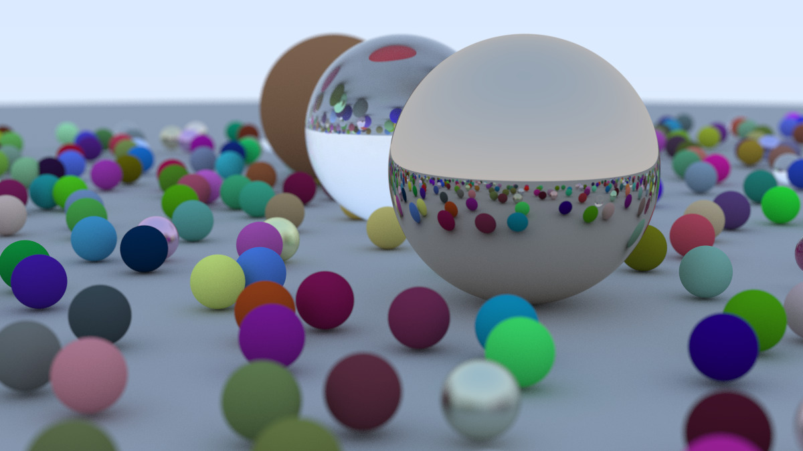

# Rustracer

A simple raytracer implementation in Rust

Based on [Ray Tracing in One Weekend](https://raytracing.github.io/) series but rewritten in Rust for educational purposes.

## Installation

Install [Cargo](https://doc.rust-lang.org/stable/cargo/)

```bash
curl https://sh.rustup.rs -sSf | sh
```

Install dependencies

```bash
cargo install
```

Run

```bash
cargo run > image.ppm
```

## Render result



## Roadmap

- [ ] Lights
- [ ] Triangle intersection
- [ ] Surface textures
- [ ] Solid textures
- [ ] Volumes and media
- [ ] Parallelism
- [ ] Additional image formats (.jpg/.png)
